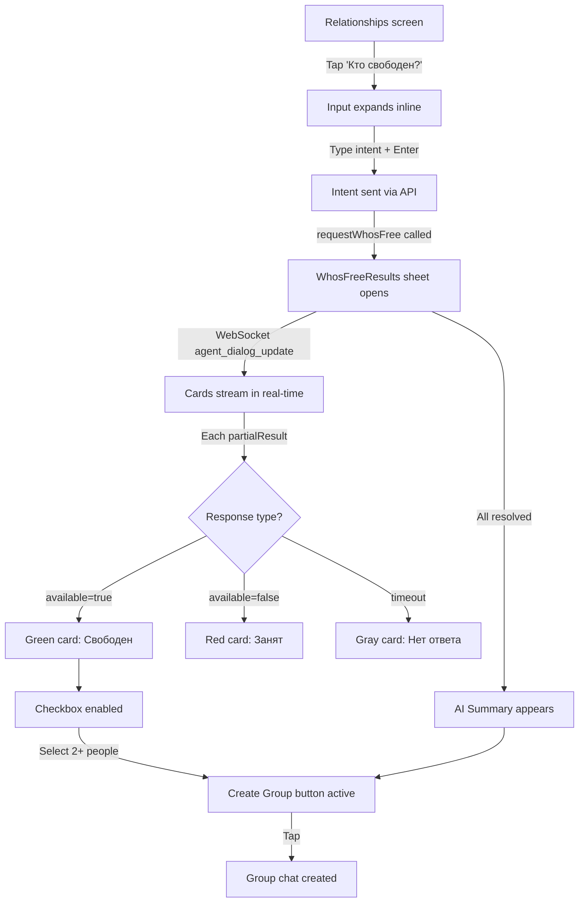
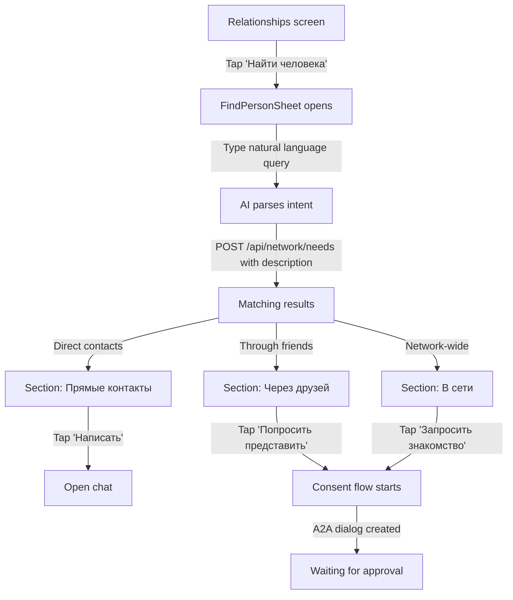
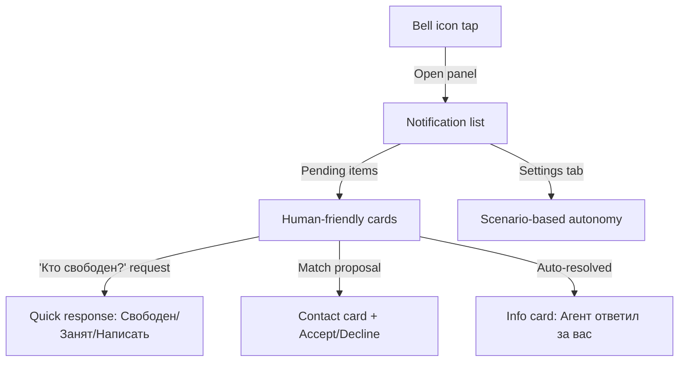

# A2A Network: UX/UI Design Specification

> Version 1.0, 2026-03-29. Designer: Claude Opus 4.6.

---

## 1. User Flow Diagrams

### 1.1. "Who's Free?" / "Давай соберёмся" Flow



### 1.2. "Find Person" / "Найти человека" Flow



### 1.3. Agent Dialog Panel Flow



---

## 2. Component Hierarchy

```
Relationships.tsx (page)
├── Header (existing)
├── Quick Actions (existing: "Кто свободен?" + "Найти человека")
├── WhosFreeResultsSheet (NEW) ← primary deliverable
│   ├── WhosFreeHeader (intent text + progress counter)
│   ├── WhosFreeResponseCard (per friend, streamed)
│   │   ├── Avatar
│   │   ├── Status badge (available/busy/waiting/auto)
│   │   ├── Message text
│   │   ├── Autonomy label
│   │   └── Checkbox (for group creation)
│   ├── WhosFreeAISummary (bottom summary)
│   └── WhosFreeActions (Create group / Write to all)
├── FindPersonSheet (NEW — replaces NetworkSheet)
│   ├── NaturalLanguageInput
│   ├── SuggestionChips
│   ├── MatchResultCard
│   │   ├── Avatar + Name (or anonymous)
│   │   ├── Trust indicator (social distance)
│   │   ├── Skill/description
│   │   └── Action button
│   └── EmptyState
├── AgentDialogPanel (REDESIGNED)
│   ├── AgentNotificationCard (human-friendly)
│   │   ├── QuickResponseButtons
│   │   └── AutoActionInfo
│   └── AgentAutonomySettings (REDESIGNED — scenario-based)
├── Contact Grid (existing)
└── Modals (existing)
```

---

## 3. Wireframe Descriptions

### 3.1. WhosFreeResultsSheet

**Type:** Bottom sheet (full height, 85vh max)
**Trigger:** After `requestWhosFree()` succeeds
**Components:** Custom sheet with slide-up animation (matching existing NetworkSheet pattern)

```
┌──────────────────────────────────────┐
│ ─── (drag handle)                    │
│                                      │
│ 👋 Давай соберёмся                   │  ← h2, green gradient text
│ "В бар вечером, 3-4 человека"        │  ← intent text, text-secondary
│                                      │
│ Ответили 2 из 5                      │  ← live counter, animated
│ ████████░░░░░░░░░░░░ (progress bar)  │
│                                      │
│ ┌────────────────────────────────┐   │
│ │ [☑] 👤 Маша          Свободна │   │  ← green bg, checkbox
│ │     "Ура, давно хотела!"      │   │  ← message
│ │     🤖 Агент ответил          │   │  ← auto badge, small
│ └────────────────────────────────┘   │
│                                      │
│ ┌────────────────────────────────┐   │
│ │ [☑] 👤 Петя          Свободен │   │
│ │     "Только после 8"          │   │
│ │     ✍️ Ответил сам            │   │  ← manual badge
│ └────────────────────────────────┘   │
│                                      │
│ ┌────────────────────────────────┐   │
│ │ [·] 👤 Коля     ⏳ Ждём...    │   │  ← gray, pulsating dot
│ │     (skeleton shimmer)         │   │
│ └────────────────────────────────┘   │
│                                      │
│ ┌────────────────────────────────┐   │
│ │     👤 Аня             Занята │   │  ← red tint, no checkbox
│ │     "Дедлайн на работе"       │   │
│ │     🤖 Агент ответил          │   │
│ └────────────────────────────────┘   │
│                                      │
│ ┌─────────────────────────────────┐  │
│ │ 💡 Маша и Петя свободны.       │  │  ← AI summary card
│ │    Маша после 7, Петя после 8. │  │     purple tint
│ │    Предлагаю встретиться в 8.  │  │
│ └─────────────────────────────────┘  │
│                                      │
│ [  Создать группу (2)  ]            │  ← primary button, shows count
│ [  Написать каждому    ]            │  ← secondary/ghost button
└──────────────────────────────────────┘
```

**Key interactions:**
- Cards animate in (fade + slide up) as WebSocket events arrive
- Waiting cards show skeleton shimmer
- Checkboxes only on "available" cards
- "Создать группу" button shows selected count, disabled until >= 2
- Progress bar animates as responses come in
- AI summary appears when all responses received (or after timeout)

### 3.2. FindPersonSheet

**Type:** Bottom sheet (replaces NetworkSheet form)
**Components:** Single text input + results

```
┌──────────────────────────────────────┐
│ ─── (drag handle)                    │
│                                      │
│ 🔍 Найти человека                    │
│                                      │
│ ┌────────────────────────────────┐   │
│ │ Кого ищете? Опишите своими     │   │  ← large textarea
│ │ словами...                     │   │
│ └────────────────────────────────┘   │
│                                      │
│ [Дизайнер] [Репетитор] [Врач]       │  ← suggestion chips
│ [Разработчик] [Юрист]               │
│                                      │
│ ─── После ввода и отправки ───       │
│                                      │
│ 🤖 Ищу в вашей сети...              │  ← loading state
│                                      │
│ Прямые контакты:                     │
│ ┌────────────────────────────────┐   │
│ │ 👤 Коля — UI/UX дизайн        │   │
│ │    Из вашей переписки          │   │
│ │    [Написать]                  │   │
│ └────────────────────────────────┘   │
│                                      │
│ Через друзей:                        │
│ ┌────────────────────────────────┐   │
│ │ 👤 Катя — Веб-дизайнер        │   │
│ │    через Петю · ⭐⭐⭐⭐        │   │
│ │    [Попросить представить]     │   │
│ └────────────────────────────────┘   │
│                                      │
│ Нет результатов?                     │
│ [Создать запрос в сеть]             │  ← fallback to old flow
└──────────────────────────────────────┘
```

### 3.3. AgentDialogPanel (Redesigned)

**Changed from:** Technical dialog list with type/status badges
**Changed to:** Human-friendly notification center

```
┌──────────────────────────────────────┐
│ 🔔 Уведомления           [⚙] [✕]   │
│ [Все] [Новые (2)] [История]         │
│──────────────────────────────────────│
│                                      │
│ ┌────────────────────────────────┐   │
│ │ 👤 Иван спрашивает, свободен  │   │  ← human language
│ │    ли ты сегодня вечером       │   │
│ │                                │   │
│ │ [✓ Свободен] [✕ Занят] [💬]   │   │  ← quick response
│ │                        5м назад│   │
│ └────────────────────────────────┘   │
│                                      │
│ ┌────────────────────────────────┐   │
│ │ 🤖 Ваш агент ответил Маше,    │   │  ← auto-action info
│ │    что вы свободны сегодня     │   │
│ │                                │   │
│ │ [Отменить ответ]      10м назад│   │
│ └────────────────────────────────┘   │
│                                      │
│ ┌────────────────────────────────┐   │
│ │ 🤝 Петя хочет познакомить вас │   │
│ │    с Катей (дизайнер)          │   │
│ │                                │   │
│ │ [Принять] [Отклонить]  1ч назад│   │
│ └────────────────────────────────┘   │
└──────────────────────────────────────┘
```

### 3.4. AgentAutonomySettings (Redesigned)

**Changed from:** Matrix table (relationship x dialog type x action)
**Changed to:** Scenario-based toggles with plain language

```
┌──────────────────────────────────────┐
│ Как работает ваш агент               │
│                                      │
│ Когда близкий друг спрашивает,       │
│ свободен ли я:                       │
│ [Отвечать автоматически ────── ✓]    │  ← toggle ON
│                                      │
│ Когда друг спрашивает, свободен      │
│ ли я:                                │
│ [Всегда спрашивать меня ────── ✓]    │  ← toggle ON
│                                      │
│ Когда кто-то хочет познакомить:      │
│ [Всегда спрашивать меня ────── ✓]    │  ← toggle ON, locked
│                                      │
│ Когда друг запрашивает мои           │
│ интересы:                            │
│ [Делиться автоматически ────── ✓]    │  ← toggle ON
│                                      │
│                [Сохранить]           │
└──────────────────────────────────────┘
```

---

## 4. Interaction Patterns

### 4.1. Animations
- **Card entry:** `fadeIn + translateY(12px)` with 150ms stagger between cards
- **Sheet open:** `translateY(100%) -> translateY(0)` with 300ms ease-out (existing pattern)
- **Progress bar:** CSS transition `width` with 500ms ease
- **Waiting pulse:** Subtle opacity pulse on "waiting" cards (0.4 -> 1.0)
- **Checkbox:** Scale bounce on check (0.8 -> 1.1 -> 1.0)

### 4.2. Loading States
- **WhosFreeResults initial:** Skeleton cards (3 gray shimmer placeholders)
- **FindPerson search:** Inline spinner with "Ищу в вашей сети..."
- **Card streaming:** New cards fade in, existing "waiting" cards remain with pulse

### 4.3. Real-time Updates
- Listen to `agent_dialog_update` WebSocket events
- Match `partialResult.dialogId` to active WhosFree session
- Append new response card with animation
- Update progress counter
- When `allResolved === true`, show AI summary

---

## 5. Edge Cases

| Scenario | Behavior |
|---|---|
| No friends have agents | Show message: "Ваши друзья пока не подключили агентов. Результаты могут прийти позже." |
| All declined | Show empathetic empty state: "Сегодня не получилось. Попробуйте другой день?" + Retry button |
| Nobody responded (timeout) | After 2h: "Никто не ответил. Возможно, попробовать написать лично?" |
| Only 1 person available | Hide "Создать группу", show "Написать [Name]" |
| Network sheet: 0 matches | "Не нашёл среди знакомых. Создайте запрос — агенты друзей увидят его." |
| WebSocket disconnect mid-stream | Show banner: "Соединение прервано. Переподключаемся..." + auto-retry |
| Rate limit (>1 per 6h) | Disable button: "Подождите X часов до следующего запроса" |
| User closes sheet while streaming | Results continue collecting in background, badge shows count |

---

## 6. Responsive Breakpoints

| Breakpoint | Layout |
|---|---|
| 375px (mobile, primary) | Full-width sheets, single column cards, bottom sheet 85vh |
| 768px (tablet) | Sheet max-width 480px centered, cards can be wider |
| 1024px+ (desktop) | Side panel instead of sheet (slide from right, max-width 420px) |

All components use existing Tailwind breakpoints: `sm:`, `md:`, `lg:`.

---

## 7. Accessibility Notes

- All interactive elements have `focus:outline-none focus:ring-2 focus:ring-accent/50`
- Color is never the sole indicator (icons + text accompany every status)
- Touch targets minimum 44x44px on mobile
- Screen reader: `aria-label` on status badges, `role="status"` on live counter
- Reduced motion: Respect `prefers-reduced-motion` for card animations
- Keyboard: Tab through cards, Enter to toggle checkbox, Escape to close sheet

---

## 8. New Files to Create

| File | Purpose |
|---|---|
| `client/src/components/agent/WhosFreeResults.tsx` | Main results sheet component |
| `client/src/components/network/FindPersonSheet.tsx` | Redesigned search with NL input |

## 9. Files to Modify

| File | Changes |
|---|---|
| `client/src/pages/Relationships.tsx` | Add WhosFreeResults integration, update "Найти человека" button |
| `client/src/components/agent/AgentDialogPanel.tsx` | Redesign to human-friendly notifications |
| `client/src/components/agent/AgentAutonomySettings.tsx` | Redesign to scenario-based toggles |
| `client/src/stores/agentDialogStore.ts` | Add activeWhosFreeDialogId tracking |
